In Februrary 2020, I created a gist instruction to set up minikube [here](https://gist.github.com/growingspaghetti/c7810d40f5d1ca91ae75a697e40adb35).

Instead, this README provides the instruction to set up kuberentes (**kubeadm**) in a gcloud n1-standard-1 ubuntu instance.

As a bonus stage, I also added the instruction to register Go apps to **dockerhub** and deploy them with **Metallb**, **nginx-ingress** and the persistant volume claims.

# Table of Contents
[Table of Contents](#table-of-contents), [Create a gcloud new project](#create-a-gcloud-new-project), [Ubuntu vm setup (terraform)](#ubuntu-vm-setup-terraform), [Terraform](#terraform), [Install kubeadm in the Ubuntu vm](#install-kubeadm-in-the-ubuntu-vm), [Init kubeadm](#init-kubeadm), [Install flannel network fabricator](#install-flannel-network-fabricator), [Install kubernetes Dashboard](#install-kubernetes-dashboard), [Login the kubernetes dashboard from the kubectl in your laptop](#login-the-kubernetes-dashboard-from-the-kubectl-in-your-laptop)

[Deploy my golang apps](#deploy-my-golang-apps), [Register my golang apps to DockerHub](#register-my-golang-apps-to-dockerhub), [Metallb host IP](#metallb-host-ip), [Reduce CPU request](#reduce-cpu-request), [Nginx-ingress reverse proxy](#nginx-ingress-reverse-proxy), [Final deployment with pvc](#final-deployment-with-pvc)

# Create a gcloud new project
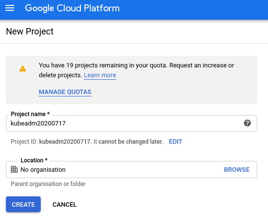

# Ubuntu vm setup (terraform)
settings.json vscode

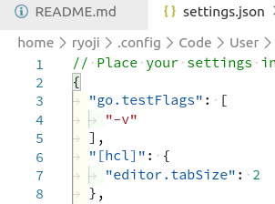

```
	"[hcl]": {
		"editor.tabSize": 2
	},
```

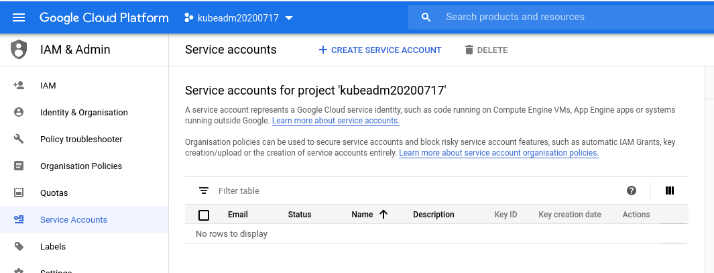

Create a service account.

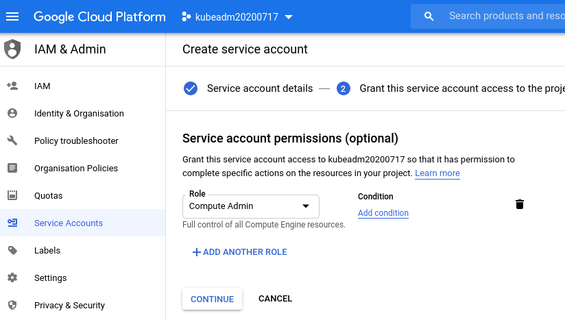

Add the compute admin role.

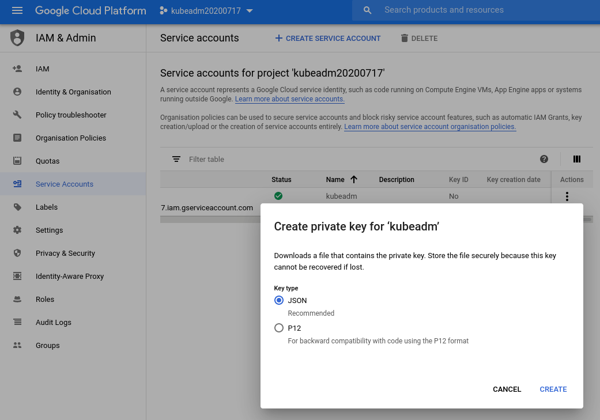

Create a json key.

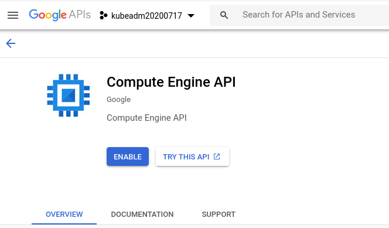

Enable compute engine api.

[Back to Table of Contents](#table-of-contents)

## Terraform

<pre><font color="#A6E22E"><b>ryoji@ubuntu</b></font>:<font color="#66D9EF"><b>/media/local/bin</b></font>$ wget https://releases.hashicorp.com/terraform/0.12.28/terraform_0.12.28_linux_amd64.zip
<font color="#A6E22E"><b>ryoji@ubuntu</b></font>:<font color="#66D9EF"><b>/media/local/bin</b></font>$ unzip terraform_0.12.28_linux_amd64.zip 
Archive:  terraform_0.12.28_linux_amd64.zip
  inflating: terraform               
<font color="#A6E22E"><b>ryoji@ubuntu</b></font>:<font color="#66D9EF"><b>/media/local/bin</b></font>$ rm terraform_0.12.28_linux_amd64.zip</pre>


<pre><font color="#A6E22E"><b>ryoji@ubuntu</b></font>:<font color="#66D9EF"><b>/media/VirtualBox VMs/vm-k8s</b></font>$ terraform init

<font color="#469CF1"><b>Initializing the backend...</b></font>

<font color="#A6E22E">Successfully configured the backend &quot;local&quot;! Terraform will automatically</font>
<font color="#A6E22E">use this backend unless the backend configuration changes.</font>

<font color="#469CF1"><b>Initializing provider plugins...</b></font>
- Checking for available provider plugins...
- Downloading plugin for provider &quot;google&quot; (hashicorp/google) 3.30.0...

<font color="#A6E22E"><b>Terraform has been successfully initialized!</b></font>

<font color="#A6E22E">You may now begin working with Terraform. Try running &quot;terraform plan&quot; to see</font>
<font color="#A6E22E">any changes that are required for your infrastructure. All Terraform commands</font>
<font color="#A6E22E">should now work.</font>

<font color="#A6E22E">If you ever set or change modules or backend configuration for Terraform,</font>
<font color="#A6E22E">rerun this command to reinitialize your working directory. If you forget, other</font>
<font color="#A6E22E">commands will detect it and remind you to do so if necessary.</font>
</pre>

<pre><font color="#A6E22E"><b>ryoji@ubuntu</b></font>:<font color="#66D9EF"><b>/media/VirtualBox VMs/vm-k8s</b></font>$ terraform plan -out out.plan
<font color="#469CF1"><b>Refreshing Terraform state in-memory prior to plan...</b></font>
The refreshed state will be used to calculate this plan, but will not be
persisted to local or remote state storage.


------------------------------------------------------------------------

An execution plan has been generated and is shown below.
Resource actions are indicated with the following symbols:
  <font color="#A6E22E">+</font> create

Terraform will perform the following actions:

<font color="#469CF1"><b>  # google_compute_firewall.allow-external</b></font> will be created
  <font color="#A6E22E">+</font> resource &quot;google_compute_firewall&quot; &quot;allow-external&quot; {
      <font color="#A6E22E">+</font> creation_timestamp = (known after apply)
      <font color="#A6E22E">+</font> destination_ranges = (known after apply)
      <font color="#A6E22E">+</font> direction          = (known after apply)
      <font color="#A6E22E">+</font> id                 = (known after apply)
      <font color="#A6E22E">+</font> name               = &quot;k8s-allow-external&quot;
      <font color="#A6E22E">+</font> network            = &quot;kubeadm&quot;
      <font color="#A6E22E">+</font> priority           = 1000
      <font color="#A6E22E">+</font> project            = (known after apply)
      <font color="#A6E22E">+</font> self_link          = (known after apply)
      <font color="#A6E22E">+</font> source_ranges      = [
          <font color="#A6E22E">+</font> &quot;0.0.0.0/0&quot;,
        ]
      <font color="#A6E22E">+</font> target_tags        = [
          <font color="#A6E22E">+</font> &quot;k8s-node&quot;,
        ]

      <font color="#A6E22E">+</font> allow {
          <font color="#A6E22E">+</font> ports    = [
              <font color="#A6E22E">+</font> &quot;22&quot;,
              <font color="#A6E22E">+</font> &quot;6443&quot;,
            ]
          <font color="#A6E22E">+</font> protocol = &quot;tcp&quot;
        }
      <font color="#A6E22E">+</font> allow {
          <font color="#A6E22E">+</font> ports    = []
          <font color="#A6E22E">+</font> protocol = &quot;icmp&quot;
        }
    }

<font color="#469CF1"><b>  # google_compute_firewall.allow-internal</b></font> will be created
  <font color="#A6E22E">+</font> resource &quot;google_compute_firewall&quot; &quot;allow-internal&quot; {
      <font color="#A6E22E">+</font> creation_timestamp = (known after apply)
      <font color="#A6E22E">+</font> destination_ranges = (known after apply)
      <font color="#A6E22E">+</font> direction          = (known after apply)
      <font color="#A6E22E">+</font> id                 = (known after apply)
      <font color="#A6E22E">+</font> name               = &quot;k8s-allow-internal&quot;
      <font color="#A6E22E">+</font> network            = &quot;kubeadm&quot;
      <font color="#A6E22E">+</font> priority           = 1000
      <font color="#A6E22E">+</font> project            = (known after apply)
      <font color="#A6E22E">+</font> self_link          = (known after apply)
      <font color="#A6E22E">+</font> source_ranges      = [
          <font color="#A6E22E">+</font> &quot;10.240.0.0/24&quot;,
        ]
      <font color="#A6E22E">+</font> target_tags        = [
          <font color="#A6E22E">+</font> &quot;k8s-node&quot;,
        ]

      <font color="#A6E22E">+</font> allow {
          <font color="#A6E22E">+</font> ports    = []
          <font color="#A6E22E">+</font> protocol = &quot;icmp&quot;
        }
      <font color="#A6E22E">+</font> allow {
          <font color="#A6E22E">+</font> ports    = []
          <font color="#A6E22E">+</font> protocol = &quot;ipip&quot;
        }
      <font color="#A6E22E">+</font> allow {
          <font color="#A6E22E">+</font> ports    = []
          <font color="#A6E22E">+</font> protocol = &quot;tcp&quot;
        }
      <font color="#A6E22E">+</font> allow {
          <font color="#A6E22E">+</font> ports    = []
          <font color="#A6E22E">+</font> protocol = &quot;udp&quot;
        }
    }

<font color="#469CF1"><b>  # google_compute_instance.primary_node</b></font> will be created
  <font color="#A6E22E">+</font> resource &quot;google_compute_instance&quot; &quot;primary_node&quot; {
      <font color="#A6E22E">+</font> can_ip_forward       = false
      <font color="#A6E22E">+</font> cpu_platform         = (known after apply)
      <font color="#A6E22E">+</font> current_status       = (known after apply)
      <font color="#A6E22E">+</font> deletion_protection  = false
      <font color="#A6E22E">+</font> guest_accelerator    = (known after apply)
      <font color="#A6E22E">+</font> id                   = (known after apply)
      <font color="#A6E22E">+</font> instance_id          = (known after apply)
      <font color="#A6E22E">+</font> label_fingerprint    = (known after apply)
      <font color="#A6E22E">+</font> machine_type         = &quot;n1-standard-1&quot;
      <font color="#A6E22E">+</font> metadata             = {
          <font color="#A6E22E">+</font> &quot;block-project-ssh-keys&quot; = &quot;true&quot;
          <font color="#A6E22E">+</font> &quot;sshKeys&quot;                = &lt;&lt;~EOT
                ryoji:ssh-rsa AAAAB3NzaC1yc2EAAAADA...
            EOT
        }
      <font color="#A6E22E">+</font> metadata_fingerprint = (known after apply)
      <font color="#A6E22E">+</font> min_cpu_platform     = (known after apply)
      <font color="#A6E22E">+</font> name                 = &quot;primary-node&quot;
      <font color="#A6E22E">+</font> project              = (known after apply)
      <font color="#A6E22E">+</font> self_link            = (known after apply)
      <font color="#A6E22E">+</font> tags                 = [
          <font color="#A6E22E">+</font> &quot;k8s-node&quot;,
        ]
      <font color="#A6E22E">+</font> tags_fingerprint     = (known after apply)
      <font color="#A6E22E">+</font> zone                 = &quot;europe-north1-a&quot;

      <font color="#A6E22E">+</font> boot_disk {
          <font color="#A6E22E">+</font> auto_delete                = true
          <font color="#A6E22E">+</font> device_name                = (known after apply)
          <font color="#A6E22E">+</font> disk_encryption_key_sha256 = (known after apply)
          <font color="#A6E22E">+</font> kms_key_self_link          = (known after apply)
          <font color="#A6E22E">+</font> mode                       = &quot;READ_WRITE&quot;
          <font color="#A6E22E">+</font> source                     = (known after apply)

          <font color="#A6E22E">+</font> initialize_params {
              <font color="#A6E22E">+</font> image  = &quot;ubuntu-2004-focal-v20200701&quot;
              <font color="#A6E22E">+</font> labels = (known after apply)
              <font color="#A6E22E">+</font> size   = 10
              <font color="#A6E22E">+</font> type   = &quot;pd-ssd&quot;
            }
        }

      <font color="#A6E22E">+</font> network_interface {
          <font color="#A6E22E">+</font> name               = (known after apply)
          <font color="#A6E22E">+</font> network            = (known after apply)
          <font color="#A6E22E">+</font> network_ip         = (known after apply)
          <font color="#A6E22E">+</font> subnetwork         = &quot;k8s-nodes&quot;
          <font color="#A6E22E">+</font> subnetwork_project = (known after apply)

          <font color="#A6E22E">+</font> access_config {
              <font color="#A6E22E">+</font> nat_ip       = (known after apply)
              <font color="#A6E22E">+</font> network_tier = (known after apply)
            }
        }

      <font color="#A6E22E">+</font> scheduling {
          <font color="#A6E22E">+</font> automatic_restart   = (known after apply)
          <font color="#A6E22E">+</font> on_host_maintenance = (known after apply)
          <font color="#A6E22E">+</font> preemptible         = (known after apply)

          <font color="#A6E22E">+</font> node_affinities {
              <font color="#A6E22E">+</font> key      = (known after apply)
              <font color="#A6E22E">+</font> operator = (known after apply)
              <font color="#A6E22E">+</font> values   = (known after apply)
            }
        }
    }

<font color="#469CF1"><b>  # google_compute_network.kubeadm</b></font> will be created
  <font color="#A6E22E">+</font> resource &quot;google_compute_network&quot; &quot;kubeadm&quot; {
      <font color="#A6E22E">+</font> auto_create_subnetworks         = false
      <font color="#A6E22E">+</font> delete_default_routes_on_create = false
      <font color="#A6E22E">+</font> gateway_ipv4                    = (known after apply)
      <font color="#A6E22E">+</font> id                              = (known after apply)
      <font color="#A6E22E">+</font> ipv4_range                      = (known after apply)
      <font color="#A6E22E">+</font> name                            = &quot;kubeadm&quot;
      <font color="#A6E22E">+</font> project                         = (known after apply)
      <font color="#A6E22E">+</font> routing_mode                    = (known after apply)
      <font color="#A6E22E">+</font> self_link                       = (known after apply)
    }

<font color="#469CF1"><b>  # google_compute_subnetwork.kubeadm</b></font> will be created
  <font color="#A6E22E">+</font> resource &quot;google_compute_subnetwork&quot; &quot;kubeadm&quot; {
      <font color="#A6E22E">+</font> creation_timestamp = (known after apply)
      <font color="#A6E22E">+</font> enable_flow_logs   = (known after apply)
      <font color="#A6E22E">+</font> fingerprint        = (known after apply)
      <font color="#A6E22E">+</font> gateway_address    = (known after apply)
      <font color="#A6E22E">+</font> id                 = (known after apply)
      <font color="#A6E22E">+</font> ip_cidr_range      = &quot;10.240.0.0/24&quot;
      <font color="#A6E22E">+</font> name               = &quot;k8s-nodes&quot;
      <font color="#A6E22E">+</font> network            = &quot;kubeadm&quot;
      <font color="#A6E22E">+</font> project            = (known after apply)
      <font color="#A6E22E">+</font> region             = &quot;europe-north1&quot;
      <font color="#A6E22E">+</font> secondary_ip_range = (known after apply)
      <font color="#A6E22E">+</font> self_link          = (known after apply)
    }

<font color="#469CF1"><b>Plan:</b></font> 5 to add, 0 to change, 0 to destroy.

------------------------------------------------------------------------

This plan was saved to: out.plan

To perform exactly these actions, run the following command to apply:
    terraform apply &quot;out.plan&quot;

</pre>

<pre><font color="#A6E22E"><b>ryoji@ubuntu</b></font>:<font color="#66D9EF"><b>/media/VirtualBox VMs/vm-k8s</b></font>$ terraform apply &quot;out.plan&quot;
<font color="#469CF1"><b>google_compute_network.kubeadm: Creating...</b></font>
<font color="#469CF1"><b>google_compute_network.kubeadm: Still creating... [10s elapsed]</b></font>
<font color="#469CF1"><b>google_compute_network.kubeadm: Still creating... [20s elapsed]</b></font>
<font color="#469CF1"><b>google_compute_network.kubeadm: Creation complete after 24s [id=projects/kubeadm20200717/global/networks/kubeadm]</b></font>
<font color="#469CF1"><b>google_compute_subnetwork.kubeadm: Creating...</b></font>
<font color="#469CF1"><b>google_compute_firewall.allow-external: Creating...</b></font>
<font color="#469CF1"><b>google_compute_firewall.allow-internal: Creating...</b></font>
<font color="#469CF1"><b>google_compute_subnetwork.kubeadm: Still creating... [10s elapsed]</b></font>
<font color="#469CF1"><b>google_compute_firewall.allow-external: Still creating... [10s elapsed]</b></font>
<font color="#469CF1"><b>google_compute_firewall.allow-internal: Still creating... [10s elapsed]</b></font>
<font color="#469CF1"><b>google_compute_firewall.allow-internal: Creation complete after 12s [id=projects/kubeadm20200717/global/firewalls/k8s-allow-internal]</b></font>
<font color="#469CF1"><b>google_compute_firewall.allow-external: Creation complete after 12s [id=projects/kubeadm20200717/global/firewalls/k8s-allow-external]</b></font>
<font color="#469CF1"><b>google_compute_subnetwork.kubeadm: Still creating... [20s elapsed]</b></font>
<font color="#469CF1"><b>google_compute_subnetwork.kubeadm: Creation complete after 24s [id=projects/kubeadm20200717/regions/europe-north1/subnetworks/k8s-nodes]</b></font>
<font color="#469CF1"><b>google_compute_instance.primary_node: Creating...</b></font>
<font color="#469CF1"><b>google_compute_instance.primary_node: Still creating... [10s elapsed]</b></font>
<font color="#469CF1"><b>google_compute_instance.primary_node: Creation complete after 14s [id=projects/kubeadm20200717/zones/europe-north1-a/instances/primary-node]</b></font>

<font color="#A6E22E"><b>Apply complete! Resources: 1 added, 0 changed, 0 destroyed.</b></font>

The state of your infrastructure has been saved to the path
below. This state is required to modify and destroy your
infrastructure, so keep it safe. To inspect the complete state
use the `terraform show` command.

State path: .private/terraform.tfstate
</pre>

References:
 - https://www.terraform.io/docs/providers/google/r/compute_instance.html
 - https://docs.projectcalico.org/getting-started/kubernetes/self-managed-public-cloud/gce

[Back to Table of Contents](#table-of-contents)

# Install kubeadm in the Ubuntu vm

<pre><font color="#A6E22E"><b>ryoji@ubuntu</b></font>:<font color="#66D9EF"><b>/media/VirtualBox VMs/vm-k8s</b></font>$ ssh ryoji@35.228.189.126
Welcome to Ubuntu 20.04 LTS (GNU/Linux 5.4.0-1019-gcp x86_64)

 * Documentation:  https://help.ubuntu.com
 * Management:     https://landscape.canonical.com
 * Support:        https://ubuntu.com/advantage

  System information as of Fri Jul 17 17:45:33 UTC 2020

  System load:  0.0               Processes:             99
  Usage of /:   13.8% of 9.52GB   Users logged in:       0
  Memory usage: 6%                IPv4 address for ens4: 10.240.0.2
  Swap usage:   0%

0 updates can be installed immediately.
0 of these updates are security updates.


The list of available updates is more than a week old.
To check for new updates run: sudo apt update


The programs included with the Ubuntu system are free software;
the exact distribution terms for each program are described in the
individual files in /usr/share/doc/*/copyright.

Ubuntu comes with ABSOLUTELY NO WARRANTY, to the extent permitted by
applicable law.
</pre>

<pre><font color="#A6E22E"><b>ryoji@primary-node</b></font>:<font color="#66D9EF"><b>~</b></font>$ sudo apt-get update</font>
</pre>
<pre><font color="#A6E22E"><b>ryoji@primary-node</b></font>:<font color="#66D9EF"><b>~</b></font>$ sudo apt-get install -y docker apt-transport-https curl docker.io
</pre>
<pre><font color="#A6E22E"><b>ryoji@primary-node</b></font>:<font color="#66D9EF"><b>~</b></font>$ curl -s https://packages.cloud.google.com/apt/doc/apt-key.gpg | sudo apt-key add -
OK</pre>
<pre><font color="#A6E22E"><b>ryoji@primary-node</b></font>:<font color="#66D9EF"><b>~</b></font>$ echo &quot;deb https://apt.kubernetes.io/ kubernetes-xenial main&quot; | sudo tee -a /etc/apt/sources.list.d/kubernetes.list
deb https://apt.kubernetes.io/ kubernetes-xenial main
</pre>
<pre><font color="#A6E22E"><b>ryoji@primary-node</b></font>:<font color="#66D9EF"><b>~</b></font>$ sudo apt-get update</font>
</pre>

References:
 - https://kubernetes.io/docs/tasks/tools/install-kubectl/

<pre><font color="#A6E22E"><b>ryoji@primary-node</b></font>:<font color="#66D9EF"><b>~</b></font>$ sudo swapon -s</pre>

<pre><font color="#A6E22E"><b>ryoji@primary-node</b></font>:<font color="#66D9EF"><b>~</b></font>$ sudo apt-get install -y kubelet kubeadm kubectl
</pre>

<pre><font color="#A6E22E"><b>ryoji@primary-node</b></font>:<font color="#66D9EF"><b>~</b></font>$ sudo apt-mark hold kubelet kubeadm kubectl
kubelet set on hold.
kubeadm set on hold.
kubectl set on hold.
</pre>

[Back to Table of Contents](#table-of-contents)

## Init kubeadm
<pre><font color="#A6E22E"><b>ryoji@primary-node</b></font>:<font color="#66D9EF"><b>~</b></font>$ sudo kubeadm init --pod-network-cidr=10.244.0.0/16
W0717 18:02:27.766223   17123 configset.go:202] WARNING: kubeadm cannot validate component configs for API groups [kubelet.config.k8s.io kubeproxy.config.k8s.io]
[init] Using Kubernetes version: v1.18.6
[preflight] Running pre-flight checks
	[WARNING Service-Docker]: docker service is not enabled, please run &apos;systemctl enable docker.service&apos;
	[WARNING IsDockerSystemdCheck]: detected &quot;cgroupfs&quot; as the Docker cgroup driver. The recommended driver is &quot;systemd&quot;. Please follow the guide at https://kubernetes.io/docs/setup/cri/
error execution phase preflight: [preflight] Some fatal errors occurred:
	[ERROR NumCPU]: the number of available CPUs 1 is less than the required 2
[preflight] If you know what you are doing, you can make a check non-fatal with `--ignore-preflight-errors=...`
To see the stack trace of this error execute with --v=5 or higher
<font color="#A6E22E"><b>ryoji@primary-node</b></font>:<font color="#66D9EF"><b>~</b></font>$ sudo kubeadm init --pod-network-cidr=10.244.0.0/16 --ignore-preflight-errors=NumCPU
W0717 18:03:42.756173   17475 configset.go:202] WARNING: kubeadm cannot validate component configs for API groups [kubelet.config.k8s.io kubeproxy.config.k8s.io]
[init] Using Kubernetes version: v1.18.6
[preflight] Running pre-flight checks
	[WARNING NumCPU]: the number of available CPUs 1 is less than the required 2
	[WARNING Service-Docker]: docker service is not enabled, please run &apos;systemctl enable docker.service&apos;
	[WARNING IsDockerSystemdCheck]: detected &quot;cgroupfs&quot; as the Docker cgroup driver. The recommended driver is &quot;systemd&quot;. Please follow the guide at https://kubernetes.io/docs/setup/cri/
[preflight] Pulling images required for setting up a Kubernetes cluster
[preflight] This might take a minute or two, depending on the speed of your internet connection
[preflight] You can also perform this action in beforehand using &apos;kubeadm config images pull&apos;
[kubelet-start] Writing kubelet environment file with flags to file &quot;/var/lib/kubelet/kubeadm-flags.env&quot;
[kubelet-start] Writing kubelet configuration to file &quot;/var/lib/kubelet/config.yaml&quot;
[kubelet-start] Starting the kubelet
[certs] Using certificateDir folder &quot;/etc/kubernetes/pki&quot;
[certs] Generating &quot;ca&quot; certificate and key
[certs] Generating &quot;apiserver&quot; certificate and key
[certs] apiserver serving cert is signed for DNS names [primary-node kubernetes kubernetes.default kubernetes.default.svc kubernetes.default.svc.cluster.local] and IPs [10.96.0.1 10.240.0.2]
[certs] Generating &quot;apiserver-kubelet-client&quot; certificate and key
[certs] Generating &quot;front-proxy-ca&quot; certificate and key
[certs] Generating &quot;front-proxy-client&quot; certificate and key
[certs] Generating &quot;etcd/ca&quot; certificate and key
[certs] Generating &quot;etcd/server&quot; certificate and key
[certs] etcd/server serving cert is signed for DNS names [primary-node localhost] and IPs [10.240.0.2 127.0.0.1 ::1]
[certs] Generating &quot;etcd/peer&quot; certificate and key
[certs] etcd/peer serving cert is signed for DNS names [primary-node localhost] and IPs [10.240.0.2 127.0.0.1 ::1]
[certs] Generating &quot;etcd/healthcheck-client&quot; certificate and key
[certs] Generating &quot;apiserver-etcd-client&quot; certificate and key
[certs] Generating &quot;sa&quot; key and public key
[kubeconfig] Using kubeconfig folder &quot;/etc/kubernetes&quot;
[kubeconfig] Writing &quot;admin.conf&quot; kubeconfig file
[kubeconfig] Writing &quot;kubelet.conf&quot; kubeconfig file
[kubeconfig] Writing &quot;controller-manager.conf&quot; kubeconfig file
[kubeconfig] Writing &quot;scheduler.conf&quot; kubeconfig file
[control-plane] Using manifest folder &quot;/etc/kubernetes/manifests&quot;
[control-plane] Creating static Pod manifest for &quot;kube-apiserver&quot;
[control-plane] Creating static Pod manifest for &quot;kube-controller-manager&quot;
W0717 18:04:11.877869   17475 manifests.go:225] the default kube-apiserver authorization-mode is &quot;Node,RBAC&quot;; using &quot;Node,RBAC&quot;
[control-plane] Creating static Pod manifest for &quot;kube-scheduler&quot;
W0717 18:04:11.880165   17475 manifests.go:225] the default kube-apiserver authorization-mode is &quot;Node,RBAC&quot;; using &quot;Node,RBAC&quot;
[etcd] Creating static Pod manifest for local etcd in &quot;/etc/kubernetes/manifests&quot;
[wait-control-plane] Waiting for the kubelet to boot up the control plane as static Pods from directory &quot;/etc/kubernetes/manifests&quot;. This can take up to 4m0s
[apiclient] All control plane components are healthy after 20.002549 seconds
[upload-config] Storing the configuration used in ConfigMap &quot;kubeadm-config&quot; in the &quot;kube-system&quot; Namespace
[kubelet] Creating a ConfigMap &quot;kubelet-config-1.18&quot; in namespace kube-system with the configuration for the kubelets in the cluster
[upload-certs] Skipping phase. Please see --upload-certs
[mark-control-plane] Marking the node primary-node as control-plane by adding the label &quot;node-role.kubernetes.io/master=&apos;&apos;&quot;
[mark-control-plane] Marking the node primary-node as control-plane by adding the taints [node-role.kubernetes.io/master:NoSchedule]
[bootstrap-token] Using token: kfxhxv.qjhv4zdm1p2aogmp
[bootstrap-token] Configuring bootstrap tokens, cluster-info ConfigMap, RBAC Roles
[bootstrap-token] configured RBAC rules to allow Node Bootstrap tokens to get nodes
[bootstrap-token] configured RBAC rules to allow Node Bootstrap tokens to post CSRs in order for nodes to get long term certificate credentials
[bootstrap-token] configured RBAC rules to allow the csrapprover controller automatically approve CSRs from a Node Bootstrap Token
[bootstrap-token] configured RBAC rules to allow certificate rotation for all node client certificates in the cluster
[bootstrap-token] Creating the &quot;cluster-info&quot; ConfigMap in the &quot;kube-public&quot; namespace
[kubelet-finalize] Updating &quot;/etc/kubernetes/kubelet.conf&quot; to point to a rotatable kubelet client certificate and key
[addons] Applied essential addon: CoreDNS
[addons] Applied essential addon: kube-proxy

Your Kubernetes control-plane has initialized successfully!

To start using your cluster, you need to run the following as a regular user:

  mkdir -p $HOME/.kube
  sudo cp -i /etc/kubernetes/admin.conf $HOME/.kube/config
  sudo chown $(id -u):$(id -g) $HOME/.kube/config

You should now deploy a pod network to the cluster.
Run &quot;kubectl apply -f [podnetwork].yaml&quot; with one of the options listed at:
  https://kubernetes.io/docs/concepts/cluster-administration/addons/

Then you can join any number of worker nodes by running the following on each as root:

kubeadm join 10.240.0.2:6443 --token kfxhxv.qjhv4zdm1p2aogmp \
    --discovery-token-ca-cert-hash sha256:8f8e3287d763379feca311829d764d83b8c093f527bcedf5d260ded12c1de154 </pre>

<pre><font color="#A6E22E"><b>ryoji@primary-node</b></font>:<font color="#66D9EF"><b>~</b></font>$ sudo vim /etc/docker/daemon.json
<font color="#A6E22E"><b>ryoji@primary-node</b></font>:<font color="#66D9EF"><b>~</b></font>$ cat /etc/docker/daemon.json 
{
  &quot;exec-opts&quot;: [&quot;native.cgroupdriver=systemd&quot;],
  &quot;log-driver&quot;: &quot;json-file&quot;,
  &quot;log-opts&quot;: {
    &quot;max-size&quot;: &quot;100m&quot;
  },
  &quot;storage-driver&quot;: &quot;overlay2&quot;
}
</pre>

Add `Environment="KUBELET_EXTRA_ARGS=--cgroup-driver=systemd"`

<pre><font color="#A6E22E"><b>ryoji@primary-node</b></font>:<font color="#66D9EF"><b>~</b></font>$ sudo vim /etc/systemd/system/kubelet.service.d/10-kubeadm.conf
<font color="#A6E22E"><b>ryoji@primary-node</b></font>:<font color="#66D9EF"><b>~</b></font>$ sudo cat /etc/systemd/system/kubelet.service.d/10-kubeadm.conf
# Note: This dropin only works with kubeadm and kubelet v1.11+
[Service]
Environment=&quot;KUBELET_KUBECONFIG_ARGS=--bootstrap-kubeconfig=/etc/kubernetes/bootstrap-kubelet.conf --kubeconfig=/etc/kubernetes/kubelet.conf&quot;
Environment=&quot;KUBELET_CONFIG_ARGS=--config=/var/lib/kubelet/config.yaml&quot;
Environment=&quot;KUBELET_EXTRA_ARGS=--cgroup-driver=systemd&quot;
# This is a file that &quot;kubeadm init&quot; and &quot;kubeadm join&quot; generates at runtime, populating the KUBELET_KUBEADM_ARGS variable dynamically
EnvironmentFile=-/var/lib/kubelet/kubeadm-flags.env
# This is a file that the user can use for overrides of the kubelet args as a last resort. Preferably, the user should use
# the .NodeRegistration.KubeletExtraArgs object in the configuration files instead. KUBELET_EXTRA_ARGS should be sourced from this file.
EnvironmentFile=-/etc/default/kubelet
ExecStart=
ExecStart=/usr/bin/kubelet $KUBELET_KUBECONFIG_ARGS $KUBELET_CONFIG_ARGS $KUBELET_KUBEADM_ARGS $KUBELET_EXTRA_ARGS</pre>

<pre><font color="#A6E22E"><b>ryoji@primary-node</b></font>:<font color="#66D9EF"><b>~</b></font>$ mkdir -p $HOME/.kube
<font color="#A6E22E"><b>ryoji@primary-node</b></font>:<font color="#66D9EF"><b>~</b></font>$ sudo cp -i /etc/kubernetes/admin.conf $HOME/.kube/config
<font color="#A6E22E"><b>ryoji@primary-node</b></font>:<font color="#66D9EF"><b>~</b></font>$ sudo chown $(id -u):$(id -g) $HOME/.kube/config</pre>

<pre><font color="#A6E22E"><b>ryoji@primary-node</b></font>:<font color="#66D9EF"><b>~</b></font>$ sudo reboot
<font color="#A6E22E"><b>ryoji@primary-node</b></font>:<font color="#66D9EF"><b>~</b></font>$ Connection to 35.228.189.126 closed by remote host.
Connection to 35.228.189.126 closed.</pre>

[Back to Table of Contents](#table-of-contents)

## Install flannel network fabricator

https://github.com/coreos/flannel

<pre><font color="#A6E22E"><b>ryoji@primary-node</b></font>:<font color="#66D9EF"><b>~</b></font>$ sudo systemctl status kubelet
<font color="#A6E22E"><b>●</b></font> kubelet.service - kubelet: The Kubernetes Node Agent
     Loaded: loaded (/lib/systemd/system/kubelet.service; enabled; vendor preset: enabled)
    Drop-In: /etc/systemd/system/kubelet.service.d
             └─10-kubeadm.conf
     Active: <font color="#A6E22E"><b>active (running)</b></font> since Fri 2020-07-17 18:12:34 UTC; 1min 3s ago
       Docs: https://kubernetes.io/docs/home/
   Main PID: 552 (kubelet)
      Tasks: 14 (limit: 4410)
     Memory: 101.1M
     CGroup: /system.slice/kubelet.service
             └─552 /usr/bin/kubelet --bootstrap-kubeconfig=/etc/kubernetes/bootstrap-kubelet.conf --kubeconfig=/etc/kubernetes/kubelet.conf --config=/var/lib/kubelet/config.yaml --cgroup-driver=cgroupfs -<span style="background-color:#F8F8F2"><font color="#272822">&gt;</font></span>

</pre>

<pre><font color="#A6E22E"><b>ryoji@primary-node</b></font>:<font color="#66D9EF"><b>~</b></font>$ kubectl get node
NAME           STATUS     ROLES    AGE   VERSION
primary-node   NotReady   master   10m   v1.18.6
</pre>

<pre><font color="#A6E22E"><b>ryoji@primary-node</b></font>:<font color="#66D9EF"><b>~</b></font>$ kubectl apply -f https://raw.githubusercontent.com/coreos/flannel/master/Documentation/kube-flannel.yml
podsecuritypolicy.policy/psp.flannel.unprivileged created
clusterrole.rbac.authorization.k8s.io/flannel created
clusterrolebinding.rbac.authorization.k8s.io/flannel created
serviceaccount/flannel created
configmap/kube-flannel-cfg created
daemonset.apps/kube-flannel-ds-amd64 created
daemonset.apps/kube-flannel-ds-arm64 created
daemonset.apps/kube-flannel-ds-arm created
daemonset.apps/kube-flannel-ds-ppc64le created
daemonset.apps/kube-flannel-ds-s390x created
</pre>

<pre><font color="#A6E22E"><b>ryoji@primary-node</b></font>:<font color="#66D9EF"><b>~</b></font>$ kubectl get node
NAME           STATUS   ROLES    AGE   VERSION
primary-node   Ready    master   12m   v1.18.6</pre>

<pre><font color="#A6E22E"><b>ryoji@primary-node</b></font>:<font color="#66D9EF"><b>~</b></font>$ kubectl cluster-info
<font color="#A6E22E">Kubernetes master</font> is running at <font color="#F4BF75">https://10.240.0.2:6443</font>
<font color="#A6E22E">KubeDNS</font> is running at <font color="#F4BF75">https://10.240.0.2:6443/api/v1/namespaces/kube-system/services/kube-dns:dns/proxy</font>

To further debug and diagnose cluster problems, use &apos;kubectl cluster-info dump&apos;.
</pre>

[Back to Table of Contents](#table-of-contents)

## Install kubernetes Dashboard

<pre><font color="#A6E22E"><b>ryoji@primary-node</b></font>:<font color="#66D9EF"><b>~</b></font>$ kubectl apply -f https://raw.githubusercontent.com/kubernetes/dashboard/v2.0.0/aio/deploy/recommended.yaml
namespace/kubernetes-dashboard created
serviceaccount/kubernetes-dashboard created
service/kubernetes-dashboard created
secret/kubernetes-dashboard-certs created
secret/kubernetes-dashboard-csrf created
secret/kubernetes-dashboard-key-holder created
configmap/kubernetes-dashboard-settings created
role.rbac.authorization.k8s.io/kubernetes-dashboard created
clusterrole.rbac.authorization.k8s.io/kubernetes-dashboard created
rolebinding.rbac.authorization.k8s.io/kubernetes-dashboard created
clusterrolebinding.rbac.authorization.k8s.io/kubernetes-dashboard created
deployment.apps/kubernetes-dashboard created
service/dashboard-metrics-scraper created
deployment.apps/dashboard-metrics-scraper created</pre>


Re-create a service account.

References:
 - https://www.replex.io/blog/how-to-install-access-and-add-heapster-metrics-to-the-kubernetes-dashboard

<pre><font color="#A6E22E"><b>ryoji@primary-node</b></font>:<font color="#66D9EF"><b>~</b></font>$ vim kube-dashboard-access.yaml
<font color="#A6E22E"><b>ryoji@primary-node</b></font>:<font color="#66D9EF"><b>~</b></font>$ cat kube-dashboard-access.yaml 

apiVersion: v1
kind: ServiceAccount
metadata:
  labels:
    k8s-app: kubernetes-dashboard
  name: kubernetes-dashboard
  namespace: kubernetes-dashboard
---
apiVersion: rbac.authorization.k8s.io/v1beta1
kind: ClusterRoleBinding
metadata:
  name: kubernetes-dashboard
  labels:
    k8s-app: kubernetes-dashboard
roleRef:
  apiGroup: rbac.authorization.k8s.io
  kind: ClusterRole
  name: cluster-admin
subjects:
- kind: ServiceAccount
  name: kubernetes-dashboard
  namespace: kubernetes-dashboard</pre>

<pre><font color="#A6E22E"><b>ryoji@primary-node</b></font>:<font color="#66D9EF"><b>~</b></font>$ kubectl delete -f kube-dashboard-access.yaml 
serviceaccount &quot;kubernetes-dashboard&quot; deleted
clusterrolebinding.rbac.authorization.k8s.io &quot;kubernetes-dashboard&quot; deleted
<font color="#A6E22E"><b>ryoji@primary-node</b></font>:<font color="#66D9EF"><b>~</b></font>$ kubectl create -f kube-dashboard-access.yaml 
serviceaccount/kubernetes-dashboard created
clusterrolebinding.rbac.authorization.k8s.io/kubernetes-dashboard created
</pre>

Restart the dashboard pod.

<pre><font color="#A6E22E"><b>ryoji@primary-node</b></font>:<font color="#66D9EF"><b>~</b></font>$ kubectl get pods --all-namespaces
NAMESPACE              NAME                                         READY   STATUS    RESTARTS   AGE
kube-system            coredns-66bff467f8-cfgbt                     1/1     Running   0          18m
kube-system            coredns-66bff467f8-jdj9t                     1/1     Running   0          18m
kube-system            etcd-primary-node                            1/1     Running   1          18m
kube-system            kube-apiserver-primary-node                  1/1     Running   1          18m
kube-system            kube-controller-manager-primary-node         1/1     Running   1          18m
kube-system            kube-flannel-ds-amd64-4scsr                  1/1     Running   0          7m23s
kube-system            kube-proxy-zvmll                             1/1     Running   1          18m
kube-system            kube-scheduler-primary-node                  1/1     Running   1          18m
kubernetes-dashboard   dashboard-metrics-scraper-6b4884c9d5-mnsxf   1/1     Running   0          3m56s
kubernetes-dashboard   kubernetes-dashboard-7b544877d5-sqkcv        1/1     Running   0          3m56s
<font color="#A6E22E"><b>ryoji@primary-node</b></font>:<font color="#66D9EF"><b>~</b></font>$ kubectl delete pod kubernetes-dashboard-7b544877d5-sqkcv -n kubernetes-dashboard
pod &quot;kubernetes-dashboard-7b544877d5-sqkcv&quot; deleted
</pre>

Now you are supposed to log in kubernetes dashabord with this kubernetes-dashboard-token.

<pre><font color="#A6E22E"><b>ryoji@primary-node</b></font>:<font color="#66D9EF"><b>~</b></font>$ kubectl get secrets -n kubernetes-dashboard
NAME                               TYPE                                  DATA   AGE
default-token-dshzr                kubernetes.io/service-account-token   3      5m20s
kubernetes-dashboard-certs         Opaque                                0      5m20s
kubernetes-dashboard-csrf          Opaque                                1      5m20s
kubernetes-dashboard-key-holder    Opaque                                2      5m20s
kubernetes-dashboard-token-2r5sf   kubernetes.io/service-account-token   3      2m3s
<font color="#A6E22E"><b>ryoji@primary-node</b></font>:<font color="#66D9EF"><b>~</b></font>$ kubectl describe secret kubernetes-dashboard-token-2r5sf -n kubernetes-dashboard
Name:         kubernetes-dashboard-token-2r5sf
Namespace:    kubernetes-dashboard
Labels:       &lt;none&gt;
Annotations:  kubernetes.io/service-account.name: kubernetes-dashboard
              kubernetes.io/service-account.uid: 85b3b976-643c-4039-83a8-42034ca852ab

Type:  kubernetes.io/service-account-token

Data
====
ca.crt:     1025 bytes
namespace:  20 bytes
token:      eyJhbGciOiJSUzI1NiIsImtpZCI6ImptR3c3TFJrSmlsbDNIdzZYc2ZQRWdyX....</pre>

[Back to Table of Contents](#table-of-contents)

## Login the kubernetes dashboard from the kubectl in your laptop

Get .kube/config of the newly created k8s cluster.
<pre><font color="#A6E22E"><b>ryoji@primary-node</b></font>:<font color="#66D9EF"><b>~</b></font>$ cat .kube/config 
apiVersion: v1
clusters:
- cluster:
    certificate-authority-data: LS0tLS1CRU....=
    server: https://10.240.0.2:6443
  name: kubernetes
contexts:
- context:
    cluster: kubernetes
    user: kubernetes-admin
  name: kubernetes-admin@kubernetes
current-context: kubernetes-admin@kubernetes
kind: Config
preferences: {}
users:
- name: kubernetes-admin
  user:
    client-certificate-data: LS0tLS1.....
    client-key-data: LS0tLS1CRUdJTiBSU......==
</pre>

In your laptop, swap or merge your kubeconfig.
<pre><font color="#A6E22E"><b>ryoji@ubuntu</b></font>:<font color="#66D9EF"><b>/media/VirtualBox VMs/vm-k8s</b></font>$ mv ~/.kube/config ~/.kube/config.back-20200717
</pre>

<pre><font color="#A6E22E"><b>ryoji@ubuntu</b></font>:<font color="#66D9EF"><b>/media/VirtualBox VMs/vm-k8s</b></font>$ vim ~/.kube/config</pre>

Use public IP address of the VM.
<pre><font color="#A6E22E"><b>ryoji@ubuntu</b></font>:<font color="#66D9EF"><b>/media/VirtualBox VMs/vm-k8s</b></font>$ sed -i &apos;s/10.240.0.2/35.228.189.126/&apos; ~/.kube/config
</pre>

<pre><font color="#A6E22E"><b>ryoji@ubuntu</b></font>:<font color="#66D9EF"><b>/media/VirtualBox VMs/vm-k8s</b></font>$ kubectl --insecure-skip-tls-verify cluster-info
<font color="#A6E22E">Kubernetes master</font> is running at <font color="#F4BF75">https://35.228.189.126:6443</font>
<font color="#A6E22E">KubeDNS</font> is running at <font color="#F4BF75">https://35.228.189.126:6443/api/v1/namespaces/kube-system/services/kube-dns:dns/proxy</font>

To further debug and diagnose cluster problems, use &apos;kubectl cluster-info dump&apos;.</pre>

<pre><font color="#A6E22E"><b>ryoji@ubuntu</b></font>:<font color="#66D9EF"><b>/media/VirtualBox VMs/vm-k8s</b></font>$ kubectl --insecure-skip-tls-verify proxy
Starting to serve on 127.0.0.1:8001
</pre>

Get token to log in.
<pre><font color="#A6E22E"><b>ryoji@ubuntu</b></font>:<font color="#66D9EF"><b>/media/VirtualBox VMs/vm-k8s</b></font>$ kubectl --insecure-skip-tls-verify -n kubernetes-dashboard describe secret $(kubectl --insecure-skip-tls-verify -n kubernetes-dashboard get secret | grep kubernetes-dashboard-token | awk &apos;{print $1}&apos;) | grep token: | awk &apos;{print $2}&apos;
eyJhbGciOiJSUzI1NiIsImtpZCI6ImptR3c3TFJrSmlsb...</pre>

To copy it to your clipboard directly,
<pre><font color="#A6E22E"><b>ryoji@ubuntu</b></font>:<font color="#66D9EF"><b>/media/VirtualBox VMs/vm-k8s</b></font>$ kubectl --insecure-skip-tls-verify -n kubernetes-dashboard describe secret $(kubectl --insecure-skip-tls-verify -n kubernetes-dashboard get secret | grep kubernetes-dashboard-token | awk &apos;{print $1}&apos;) | grep token: | awk &apos;{print $2}&apos; | xclip -i -selection clipboard</pre>

Log in to the dashboard

http://localhost:8001/api/v1/namespaces/kubernetes-dashboard/services/https:kubernetes-dashboard:/proxy/#/login

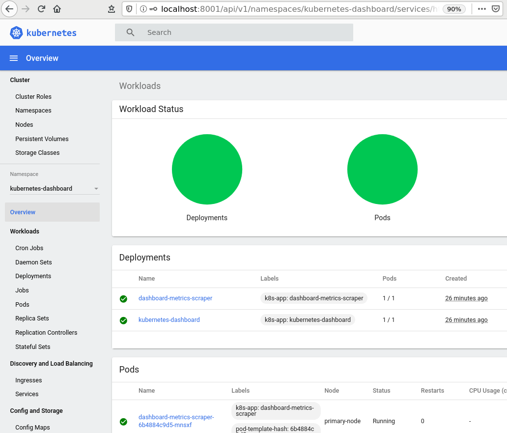

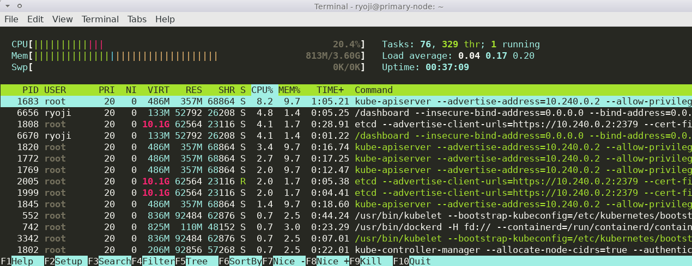

Useful command:
<pre><font color="#A6E22E"><b>ryoji@primary-node</b></font>:<font color="#66D9EF"><b>~</b></font>$ kubectl get role,rolebinding -n kubernetes-dashboard
NAME                                                  CREATED AT
role.rbac.authorization.k8s.io/kubernetes-dashboard   2020-07-17T18:19:14Z

NAME                                                         ROLE                        AGE
rolebinding.rbac.authorization.k8s.io/kubernetes-dashboard   Role/kubernetes-dashboard   27m</pre>

[Back to Table of Contents](#table-of-contents)

# Deploy my golang apps

In January 2019, I created tiny-tiny a golang app to scrape the Japanese yahoo news and another one to read those scraped articles. I re-use them this time.

 1. https://github.com/growingspaghetti/20190220-ynews/tree/master/golang/scraper/sqlite -> kubernetes CronJob
 2. https://github.com/growingspaghetti/20190220-ynews/tree/master/golang/viewer/sqlite -> kubernetes Service

[Back to Table of Contents](#table-of-contents)

## Register my golang apps to DockerHub

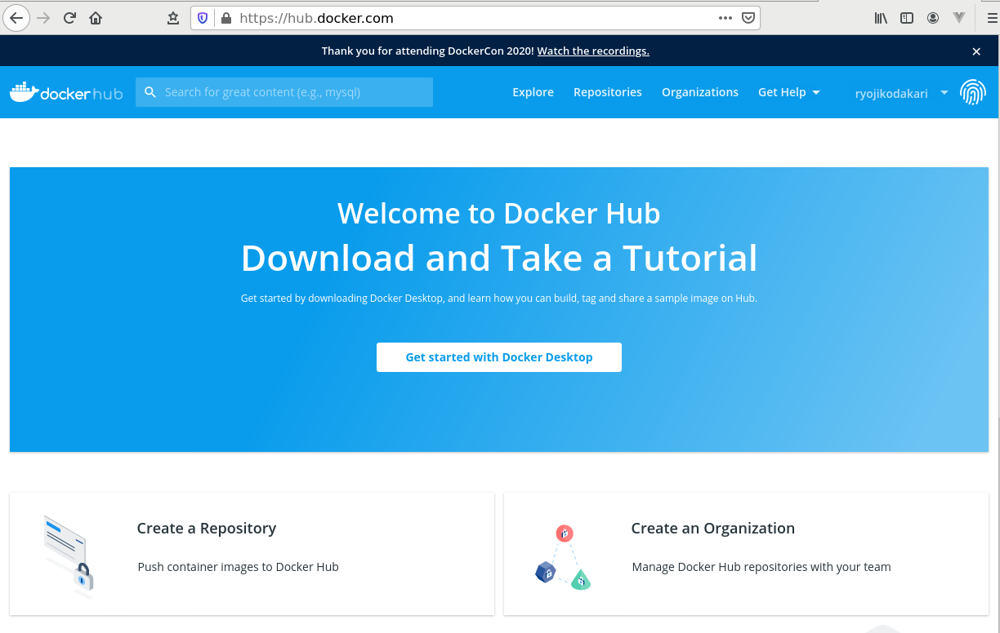

Create a repository.

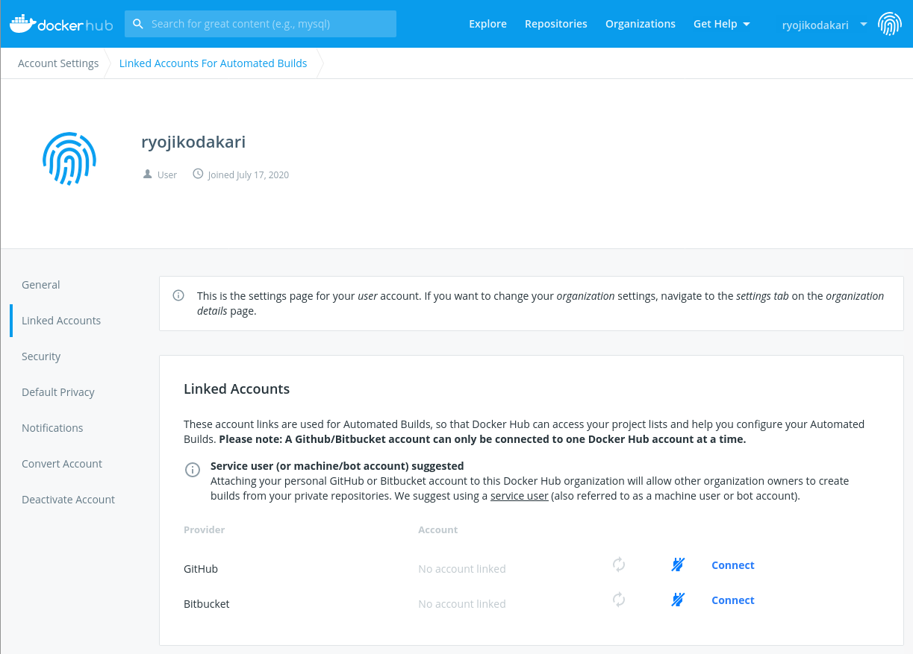

Link github account.

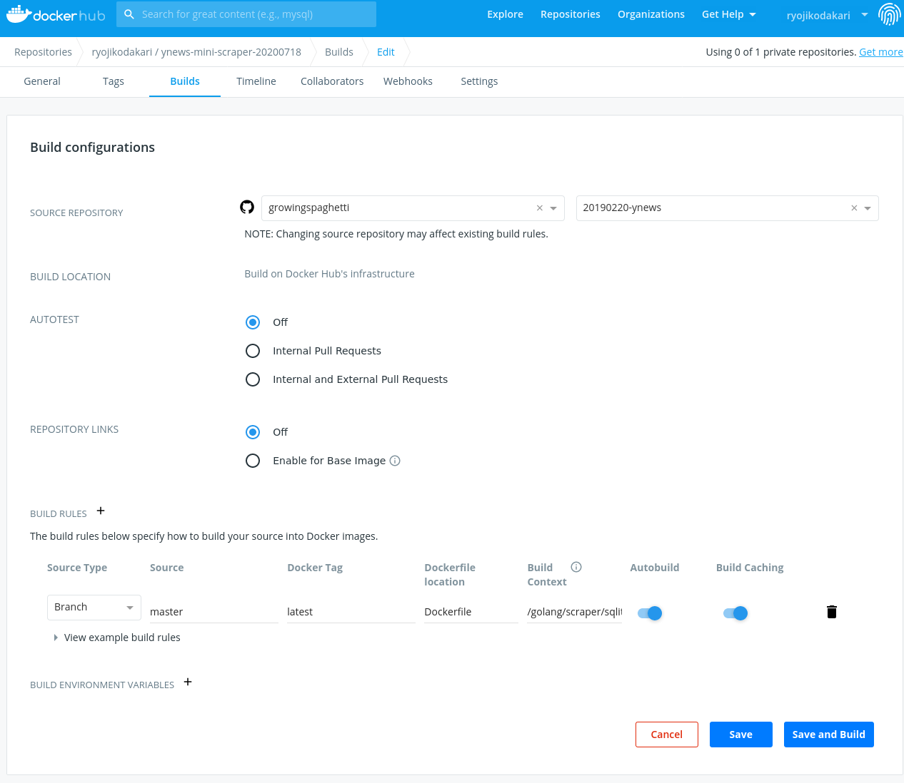

Edit build configuration with the correct path of Dockerfile.

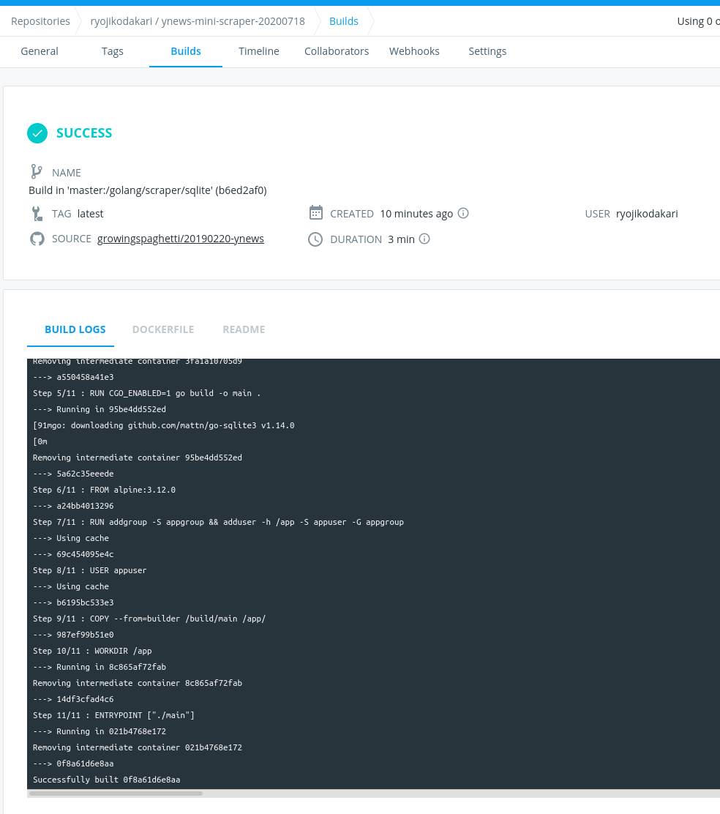

Here a mini CI is working.

 - https://hub.docker.com/r/ryojikodakari/ynews-mini-scraper-20200718
 - https://hub.docker.com/r/ryojikodakari/ynews-mini-viewer-20200718

[Back to Table of Contents](#table-of-contents)

# Metallb host IP

Reference:
 - https://metallb.universe.tf/installation/

First, reduce the CPU request (below).

```
kubectl taint nodes --all node-role.kubernetes.io/master-

kubectl get configmap kube-proxy -n kube-system -o yaml | \
sed -e "s/strictARP: false/strictARP: true/" | \
kubectl diff -f - -n kube-system

kubectl get configmap kube-proxy -n kube-system -o yaml | \
sed -e "s/strictARP: false/strictARP: true/" | \
kubectl apply -f - -n kube-system

kubectl apply -f https://raw.githubusercontent.com/metallb/metallb/v0.9.3/manifests/namespace.yaml
kubectl apply -f https://raw.githubusercontent.com/metallb/metallb/v0.9.3/manifests/metallb.yaml
kubectl create secret generic -n metallb-system memberlist --from-literal=secretkey="$(openssl rand -base64 128)"
```

Set the external IP address of this Ubuntu VM.
<pre><font color="#A6E22E"><b>ryoji@primary-node</b></font>:<font color="#66D9EF"><b>~</b></font>$ cat metallb-layer2-config.yaml 
apiVersion: v1
kind: ConfigMap
metadata:
  namespace: metallb-system
  name: config
data:
  config: |
    address-pools:
    - name: my-ip-space
      protocol: layer2
      addresses:
      - 35.228.189.126/32
</pre>

<pre><font color="#A6E22E"><b>ryoji@primary-node</b></font>:<font color="#66D9EF"><b>~</b></font>$ kubectl apply -f metallb-layer2-config.yaml
configmap/config created
</pre>

[Back to Table of Contents](#table-of-contents)

### Reduce CPU request

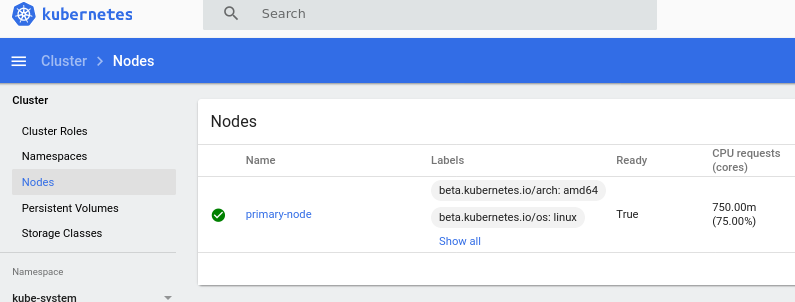

With this instruction, CPU request seems to be 95% and needs to be reduced.

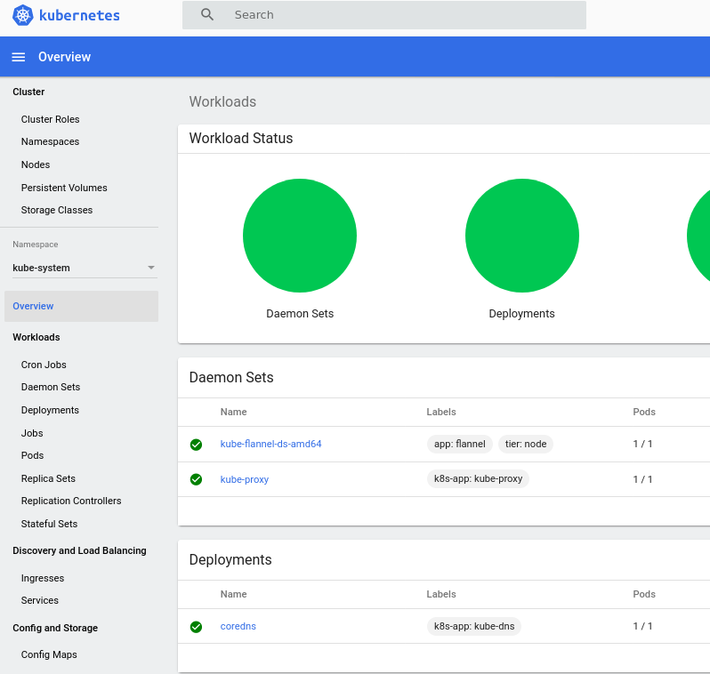

In kube-system, modify ReplicaSets, DaemonSets and Deployment, reduce the desired pot number from 2 to 1. Set request CPU to be 25m.
```
spec:
      containers:
          resources:
            limits:
              cpu: 100m
              memory: 50Mi
            requests:
              cpu: 25m
              memory: 10Mi
```

[Back to Table of Contents](#table-of-contents)

# Nginx-ingress reverse proxy

References:
 - https://github.com/kubernetes/ingress-nginx/blob/master/docs/deploy/baremetal.md

<pre><font color="#A6E22E"><b>ryoji@primary-node</b></font>:<font color="#66D9EF"><b>~</b></font>$ kubectl apply -f https://raw.githubusercontent.com/kubernetes/ingress-nginx/controller-v0.34.1/deploy/static/provider/baremetal/deploy.yaml
namespace/ingress-nginx created
serviceaccount/ingress-nginx created
configmap/ingress-nginx-controller created
clusterrole.rbac.authorization.k8s.io/ingress-nginx created
clusterrolebinding.rbac.authorization.k8s.io/ingress-nginx created
role.rbac.authorization.k8s.io/ingress-nginx created
rolebinding.rbac.authorization.k8s.io/ingress-nginx created
service/ingress-nginx-controller-admission created
service/ingress-nginx-controller created
deployment.apps/ingress-nginx-controller created
validatingwebhookconfiguration.admissionregistration.k8s.io/ingress-nginx-admission created
clusterrole.rbac.authorization.k8s.io/ingress-nginx-admission created
clusterrolebinding.rbac.authorization.k8s.io/ingress-nginx-admission created
job.batch/ingress-nginx-admission-create created
job.batch/ingress-nginx-admission-patch created
role.rbac.authorization.k8s.io/ingress-nginx-admission created
rolebinding.rbac.authorization.k8s.io/ingress-nginx-admission created
serviceaccount/ingress-nginx-admission created
</pre>

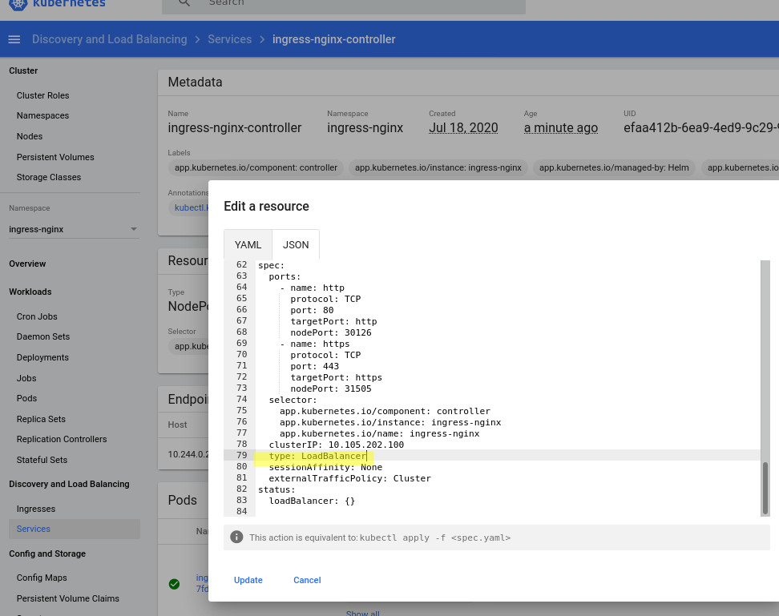

Change type from NodePort to LoadBalancer.

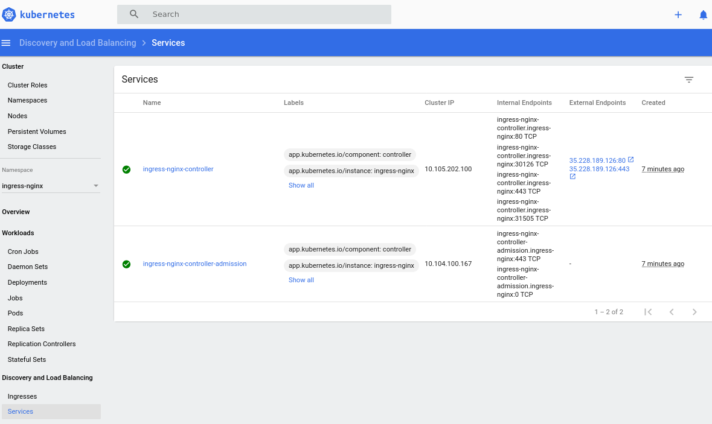

Then you can see Exeternal Endpoints are set with your Ubuntu VM external IP address.

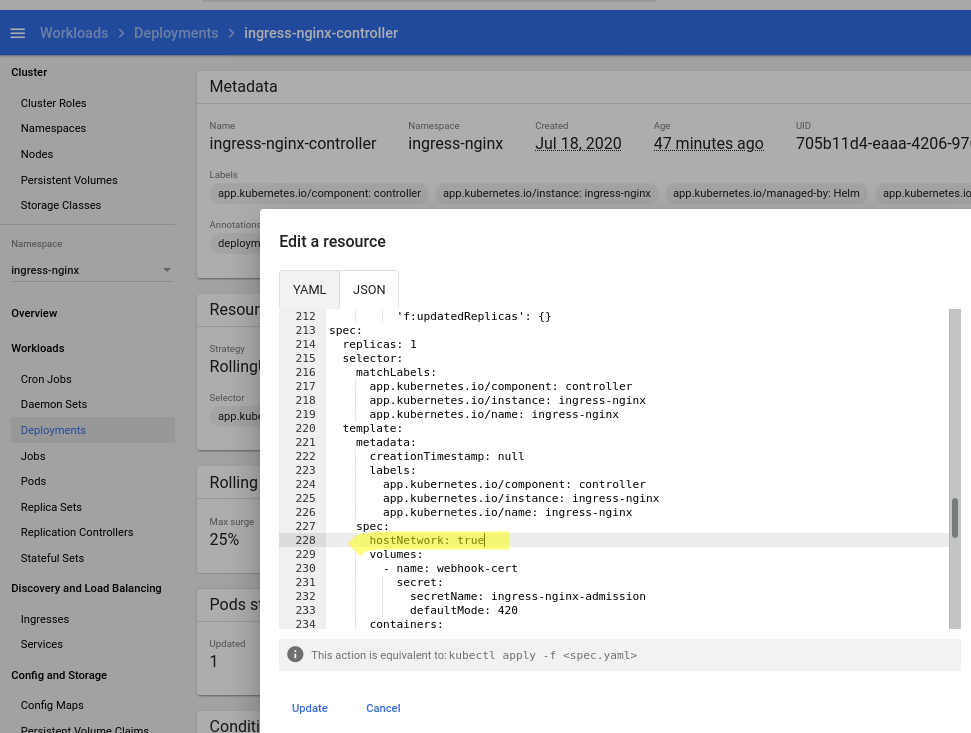

To bind this single node to nginx-ingress, add this:

```
hostNetwork: true
```

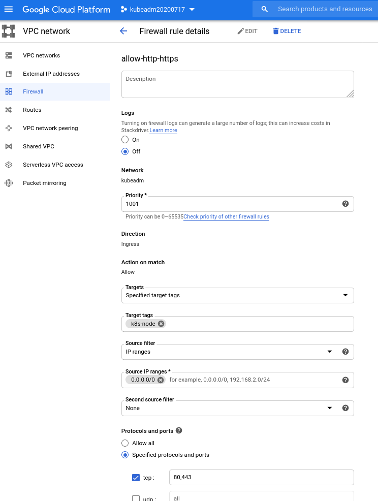

In GCP, add another firewall rule for :80 and :443.

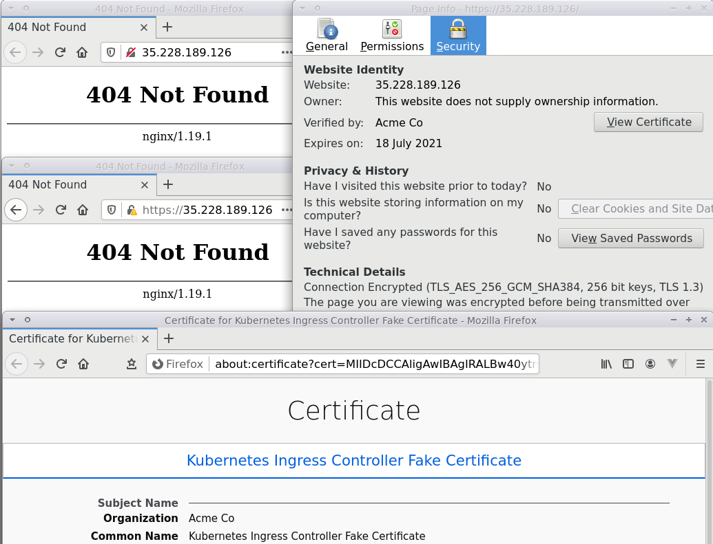

Then now, nginx->metallb->kubernetes-cluster is routed.

[Back to Table of Contents](#table-of-contents)

# Final deployment with pvc

References:
 - https://kubernetes.github.io/ingress-nginx/examples/auth/basic/

Create /mnt/data directory with 1000:1000.

<pre><font color="#A6E22E"><b>ryoji@primary-node</b></font>:<font color="#66D9EF"><b>/mnt/data</b></font>$ cd ..
<font color="#A6E22E"><b>ryoji@primary-node</b></font>:<font color="#66D9EF"><b>/mnt</b></font>$ sudo chown -R 1000:1000 data
<font color="#A6E22E"><b>ryoji@primary-node</b></font>:<font color="#66D9EF"><b>/mnt</b></font>$ cd data
<font color="#A6E22E"><b>ryoji@primary-node</b></font>:<font color="#66D9EF"><b>/mnt/data</b></font>$ ls -la
total 8
drwxr-xr-x 2 ubuntu ubuntu 4096 Jul 18 07:42 <font color="#66D9EF"><b>.</b></font>
drwxr-xr-x 3 root   root   4096 Jul 18 07:42 <font color="#66D9EF"><b>..</b></font>
</pre>

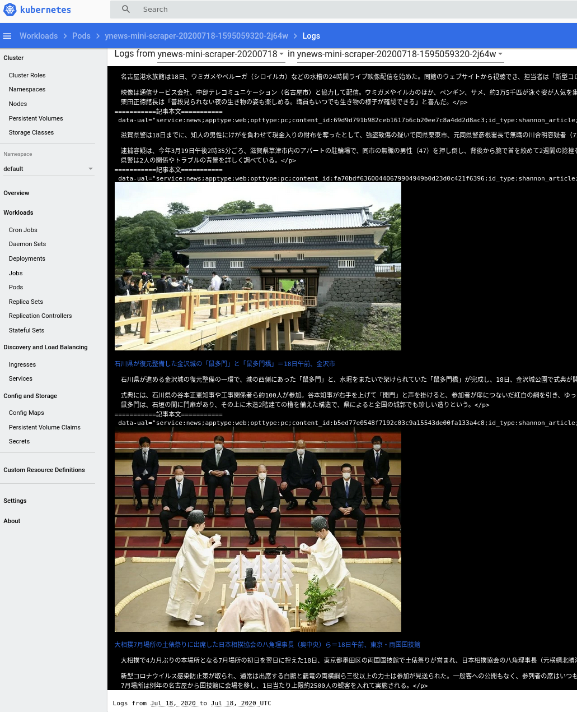

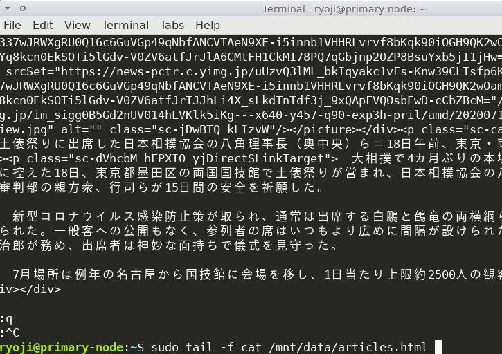

<pre><font color="#A6E22E"><b>ryoji@primary-node</b></font>:<font color="#66D9EF"><b>~</b></font>$ cat pv.yaml
apiVersion: v1
kind: PersistentVolume
metadata:
  name: ynews-mini-pv
  labels:
    type: local
spec:
  storageClassName: manual
  capacity:
    storage: 0.5Gi
  accessModes:
    - ReadWriteOnce
  hostPath:
    path: "/mnt/data"
</pre>

<pre><font color="#A6E22E"><b>ryoji@primary-node</b></font>:<font color="#66D9EF"><b>~</b></font>$ cat pv-claim.yaml
apiVersion: v1
kind: PersistentVolumeClaim
metadata:
  name: ynews-mini-pv-claim
spec:
  storageClassName: manual
  accessModes:
    - ReadWriteOnce
  resources:
    requests:
      storage: 0.4Gi
</pre>

<pre><font color="#A6E22E"><b>ryoji@primary-node</b></font>:<font color="#66D9EF"><b>~</b></font>$ cat cron.yaml 
apiVersion: batch/v1beta1
kind: CronJob
metadata:
  name: ynews-mini-scraper-20200718
spec:
  schedule: "0 12 */5 * *"
  jobTemplate:
    spec:
      template:
        spec:
          volumes:
            - name: claim-volume
              persistentVolumeClaim:
                claimName: ynews-mini-pv-claim
          containers:
          - name: ynews-mini-scraper-20200718
            image: ryojikodakari/ynews-mini-scraper-20200718
            args: ["https://headlines.yahoo.co.jp/list/?m=kyodonews"]
            volumeMounts:
              - mountPath: "/app/data"
                name: claim-volume
            securityContext:
              runAsUser: 1000
              runAsGroup: 1000
            resources:
              requests:
                cpu: 10m
          restartPolicy: OnFailure
</pre>
(Fetching 10 articles every 5 days is just enough for this purpose.)

----

<pre><font color="#A6E22E"><b>ryoji@primary-node</b></font>:<font color="#66D9EF"><b>~</b></font>$ cat deploy.yaml 
apiVersion: apps/v1
kind: Deployment
metadata:
  name: ynews-mini-viewer-20200718
  labels:
    app: ynews-mini-viewer-20200718
spec:
  replicas: 1
  selector:
    matchLabels:
      app: ynews-mini-viewer-20200718
  template:
    metadata:
      labels:
        app: ynews-mini-viewer-20200718
    spec:
      volumes:
        - name: claim-volume
          persistentVolumeClaim:
            claimName: ynews-mini-pv-claim
      containers:
      - name: ynews-mini-viewer-20200718
        image: ryojikodakari/ynews-mini-viewer-20200718
        ports:
        - containerPort: 8080
        volumeMounts:
          - mountPath: &quot;/app/data&quot;
            name: claim-volume
        securityContext:
          runAsUser: 1000
          runAsGroup: 1000
        resources:
          requests:
            cpu: 10m
</pre>

<pre><font color="#A6E22E"><b>ryoji@primary-node</b></font>:<font color="#66D9EF"><b>~</b></font>$ cat service.yaml 
apiVersion: v1
kind: Service
metadata:
  name: ynews-mini-viewer-20200718
spec:
  selector:
    app: ynews-mini-viewer-20200718
  ports:
    - protocol: TCP
      port: 80
      targetPort: 8080
</pre>

Create a secret.

<pre><font color="#A6E22E"><b>ryoji@ubuntu</b></font>:<font color="#66D9EF"><b>~</b></font>$ htpasswd -c auth ryoji
New password: 
Re-type new password: 
Adding password for user ryoji
<font color="#A6E22E"><b>ryoji@ubuntu</b></font>:<font color="#66D9EF"><b>~</b></font>$ kubectl --insecure-skip-tls-verify create secret generic basic-auth --from-file=auth
secret/basic-auth created</pre>

<pre><font color="#A6E22E"><b>ryoji@primary-node</b></font>:<font color="#66D9EF"><b>~</b></font>$ cat ingress.yaml 
apiVersion: networking.k8s.io/v1beta1
kind: Ingress
metadata:
  name: ynews-mini-viewer-20200718
  annotations:
    kubernetes.io/ingress.class: nginx
    nginx.ingress.kubernetes.io/ssl-redirect: &quot;true&quot;
    nginx.ingress.kubernetes.io/auth-type: basic
    nginx.ingress.kubernetes.io/auth-secret: basic-auth
    nginx.ingress.kubernetes.io/auth-realm: &apos;Authentication Required&apos;
spec:
  rules:
  - http:
      paths:
      - path: /
        backend:
          serviceName: ynews-mini-viewer-20200718
          servicePort: 80
</pre>

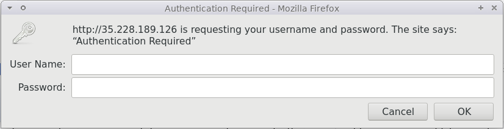


http://35.228.189.126/ u:ryoji p:k8s

[Back to Table of Contents](#table-of-contents)
